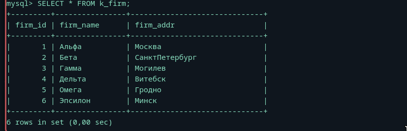
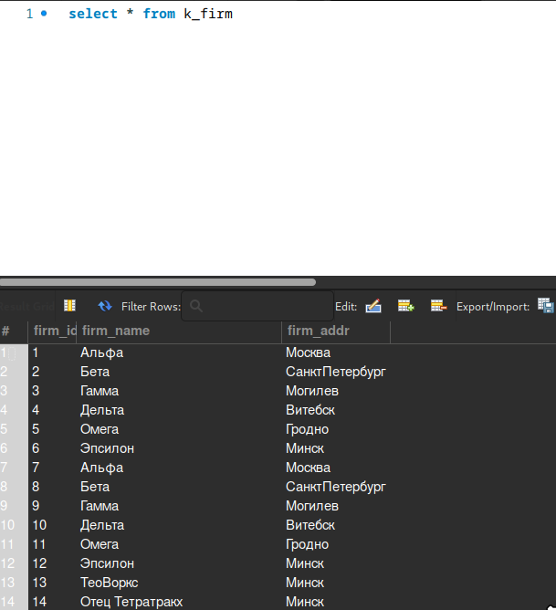
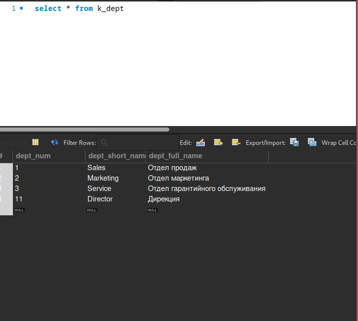
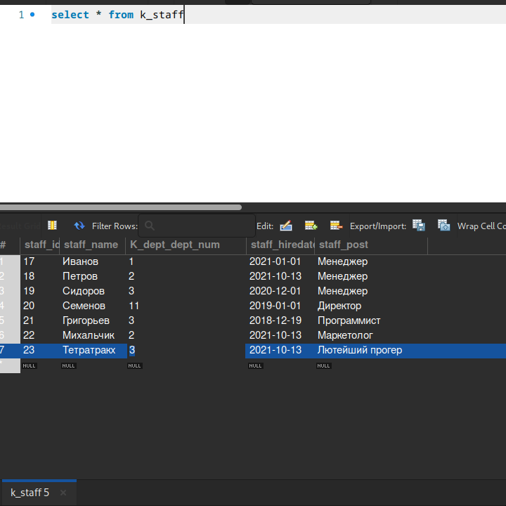

# Третья лабораторная

## создание БД


## По забавному стечению обстоятельств, в стоковом коде допущена ошибка: Город Минск не взят в кавычки, хоть это и название стринга. Но я все исправил
```sql
INSERT INTO k_firm (firm_name, firm_addr)
VALUES('Альфа', 'Москва');
INSERT INTO k_firm (firm_name, firm_addr)
VALUES('Бета', 'СанктПетербург');
INSERT INTO k_firm (firm_name, firm_addr)
VALUES('Гамма', 'Могилев');
INSERT INTO k_firm (firm_name, firm_addr)
VALUES('Дельта', 'Витебск');
INSERT INTO k_firm (firm_name, firm_addr)
VALUES('Омега', 'Гродно');
INSERT INTO k_firm (firm_name, firm_addr)
VALUES('Эпсилон', 'Минск');

SELECT * FROM k_firm;
```


### Заклинкодим, мы ж умные, после чего добавим две записи от себя
```sql 
INSERT INTO k_firm (firm_name, firm_addr)
VALUES('Альфа', 'Москва'),
      ('Бета', 'СанктПетербург'),
      ('Гамма', 'Могилев'),
      ('Дельта', 'Витебск'),
      ('Омега', 'Гродно'),
      ('Эпсилон', 'Минск');
      ('ТеоВоркс', 'Минск');
      ('Отец Тетратракх', 'Минск');
```

## Проверочка от Тео( Артема )


## K_Dept
```sql 
INSERT INTO k_dept (dept_short_name, dept_full_name) 
VALUES ('Sales', 'Отдел продаж');

INSERT INTO k_dept (dept_short_name, dept_full_name)
VALUES('Marketing', 'Отдел маркетинга');

INSERT INTO k_dept (dept_short_name, dept_full_name)
VALUES('Service', 'Отдел гарантийного обслуживания');

INSERT INTO k_dept (dept_num, dept_short_name, dept_full_name)
VALUES(11, 'Director', 'Дирекция');
```


## Все еще не понимаю, зачем разбивать на миллиард запросов

