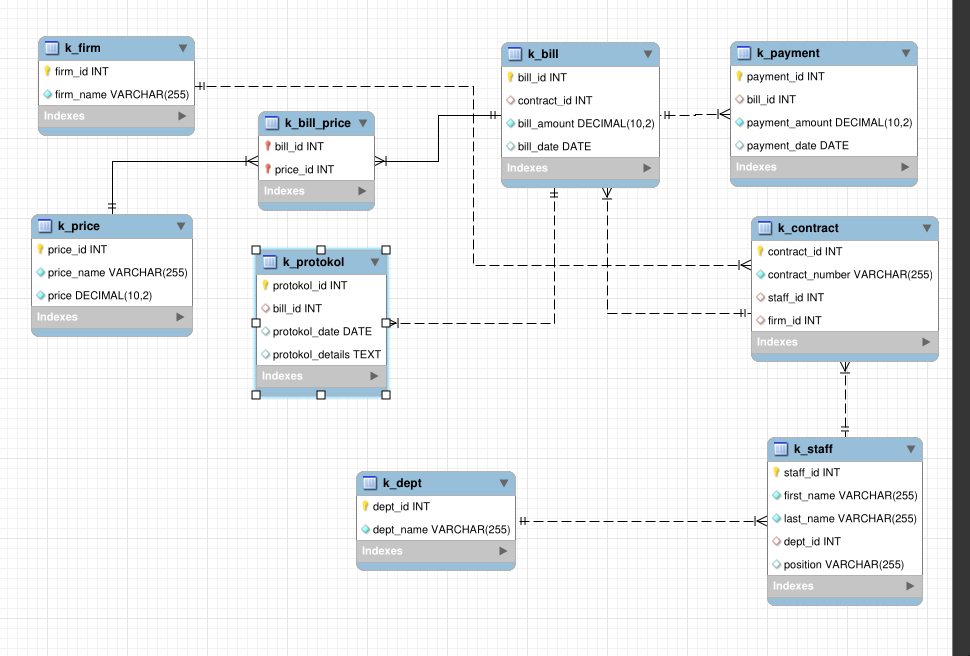
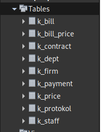

# Лабораторная Работа 2

## Построение Диаграммы

## Обьяснение
1. Работник и Отдел: Между таблицами k_staff и k_dept связь типа 1:М (много работников могут работать в одном отделе), и один работник может руководить отделом (связь 1:1).
2. Работник и Договор: Между таблицами k_staff и k_contract связь 1:М (один работник может курировать несколько договоров).
3. Договор и Предприятие: Связь между k_contract и k_firm 1:М (каждое предприятие может заключать несколько договоров).
4. Счет и Платеж: Связь между k_bill и k_payment 1:М (по одному счету может быть несколько платежей).
5. Счет и Прайс-лист: Связь между k_bill и k_price М:М (многие ко многим).
6. Таблица k_bill_price нужна для хранения комбинаций счетов и прайс-листов. Например, один счет может включать несколько позиций из прайс-листа, и эта таблица будет отслеживать такие связи.

## БД

