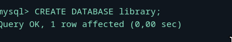
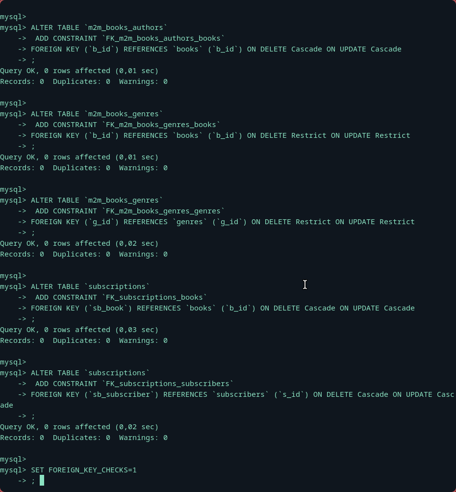
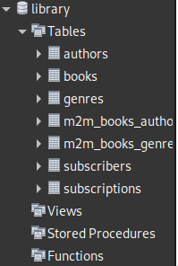
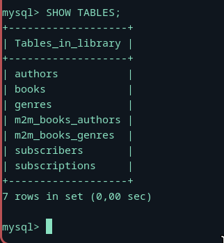
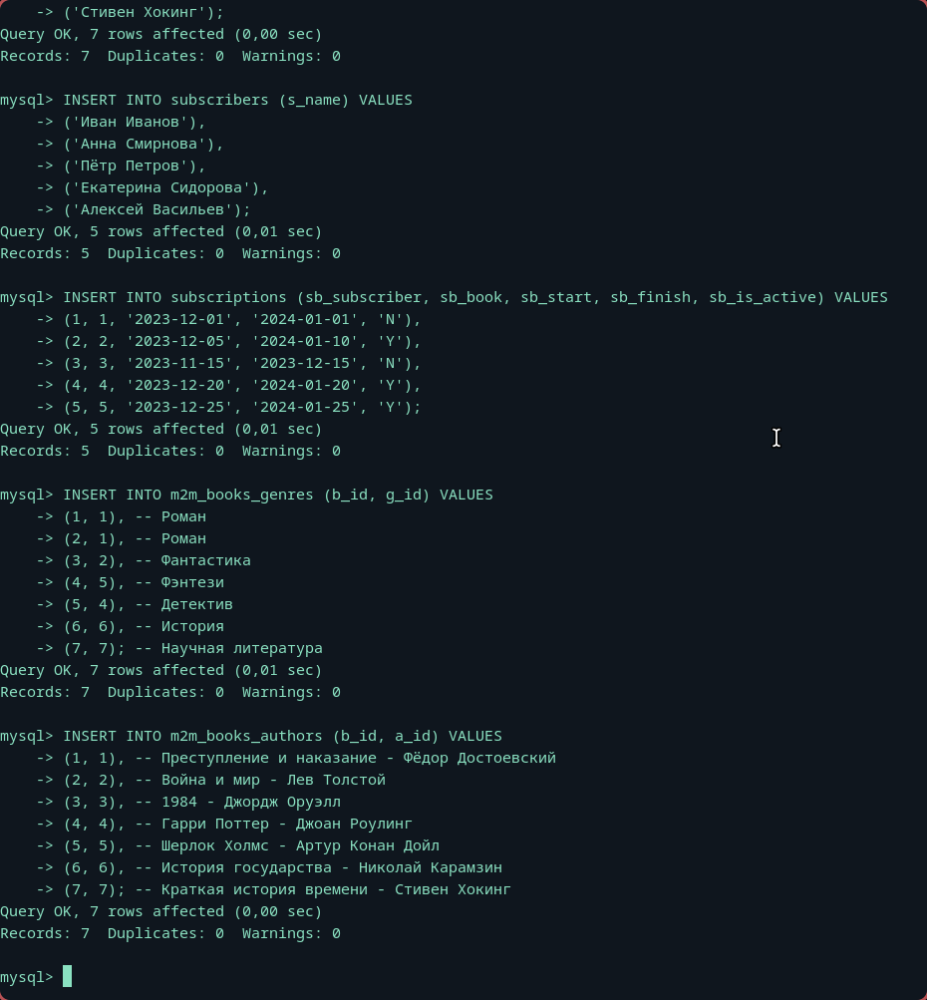
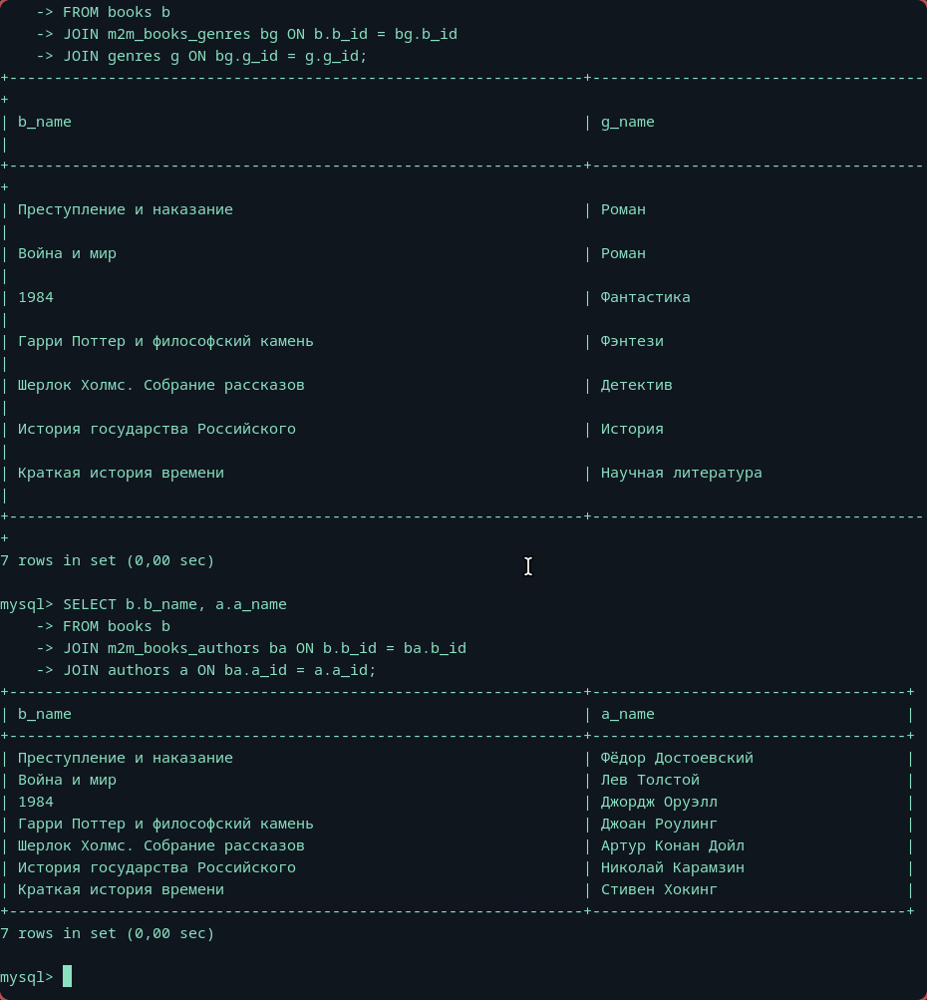
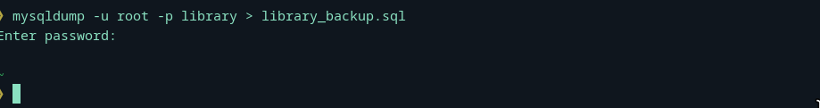

# Без долгих вступлений:

## Создание бд:

## Выполнение Скрипта:

## Что вышло(Вид из workbench):

## Show Table:

 
## Наполнение как по ТЗ:

## Связи пишем примерно так( я ТАК долго искал как это сделать):

## Дамп:

## Вот она родимая(через команду ls на linux):

### P.S Дико извиняюсь за типичный нейминг, оригинальность закончилась на первой лабе
### P.S.S После выполнения лабы увидел, что нейминги были предоставлены. Но свои даже лучше, задание ведь индивидуальное, йоу, проявил индивидуальность