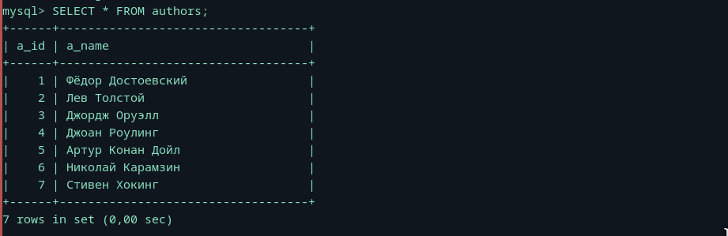
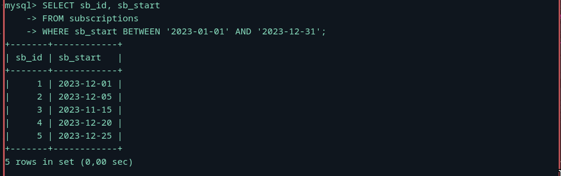
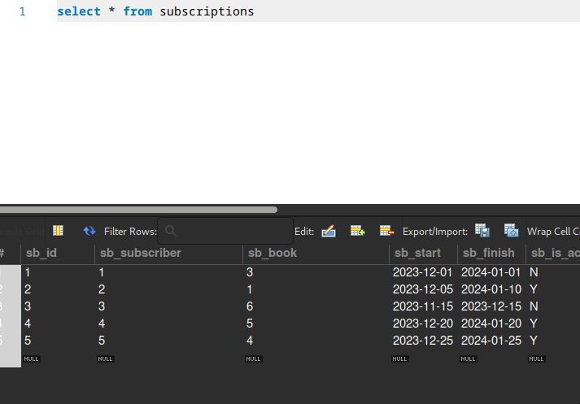
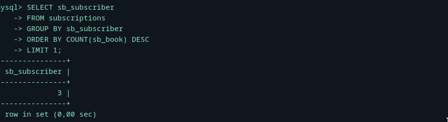
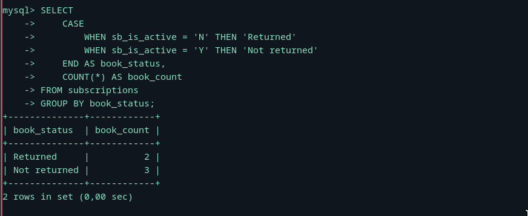
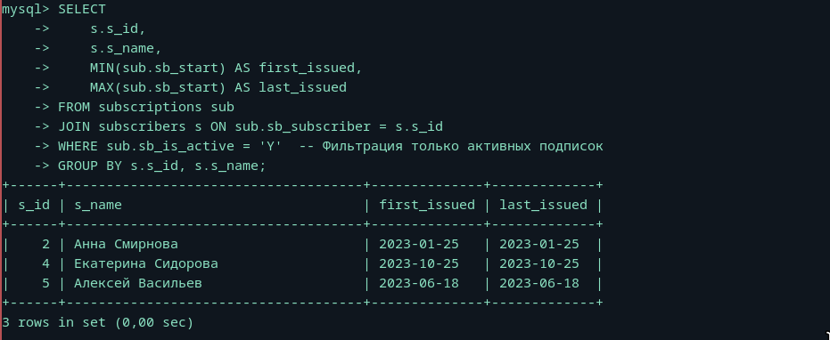

### На столько просто после первого АДА, что даже смешно

## Показать всю информацию об авторах(USE library не фоткал, но и так понятно).

## Посложнее задания сделаем(Показать идентификаторы и даты выдачи книг за первый год работы библиотеки (первым годом работы библиотеки считать все даты с первой выдачи книги по 31-е декабря (включительно) того года, когда библиотека начала работать).):

## Показать идентификатор одного (любого) читателя, взявшего в библиотеке больше всего книг(В виде топ-3, чуть веселее, для 1 лимит 1).:

## Показать, сколько книг было возвращено и не возвращено в библиотеку (СУБД должна оперировать исходными значениями поля sb_is_active (т.е. «Y» и «N»), а после подсчёта значения «Y» и «N» должны быть преобразованы в «Returned» и «Not returned»).

## Показать первую и последнюю даты выдачи книги читателю.

