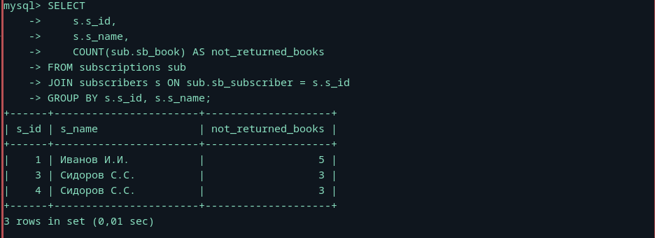
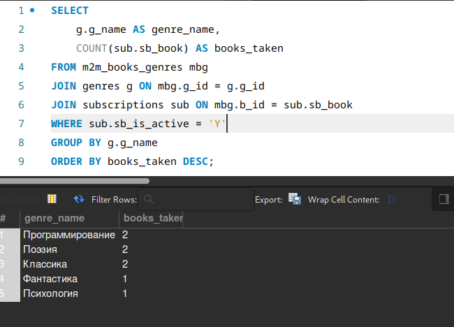
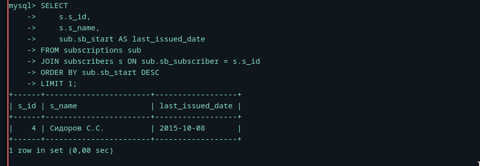
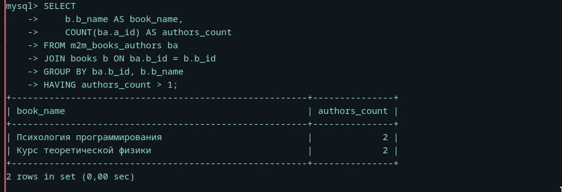

# После некоторых затруднений в 2 индивид решил использовать предоставленную таблицу

### Пример селекта

## Показать всех авторов и количество книг (не экземпляров книг, а «книг как изданий») по каждому автору.

## Показать всех читателей, не вернувших книги, и количество невозвращённых книг по каждому такому читателю.

## Показать читаемость жанров, т.е. все жанры и то количество раз, которое книги этих жанров были взяты читателями.

### Для разнообразия в workbench

## Показать читателя, последним взявшего в библиотеке книгу.

## Показать список книг, у которых более одного автора.
