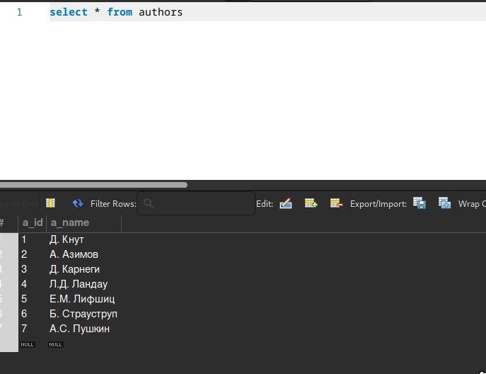
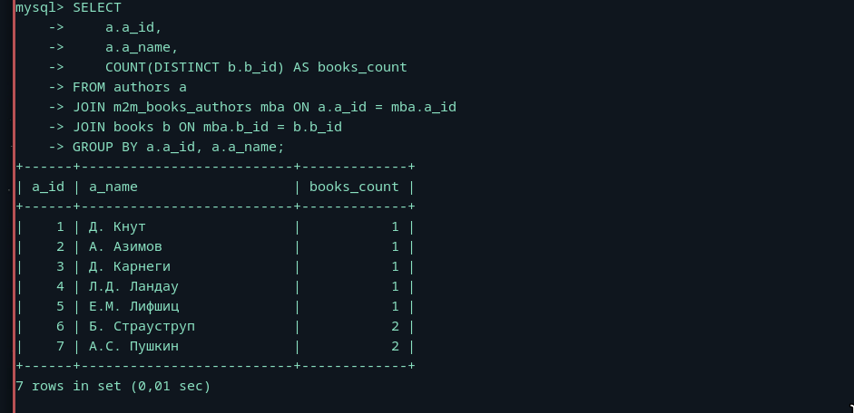

# После некоторых затруднений в 2 индивид решил использовать предоставленную таблицу

### Пример селекта

## Показать всех авторов и количество книг (не экземпляров книг, а «книг как изданий») по каждому автору.

## Показать всех читателей, не вернувших книги, и количество невозвращённых книг по каждому такому читателю.
SELECT 
    s.s_id, 
    s.s_name, 
    COUNT(sub.sb_book) AS not_returned_books
FROM subscriptions sub
JOIN subscribers s ON sub.sb_subscriber = s.s_id
GROUP BY s.s_id, s.s_name;
