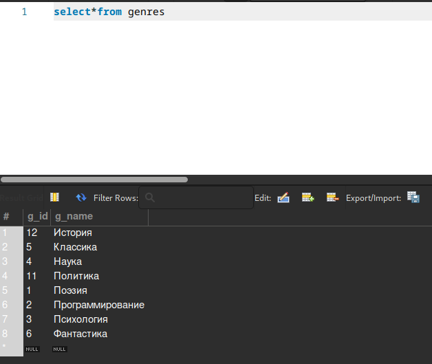
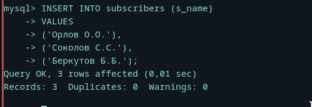
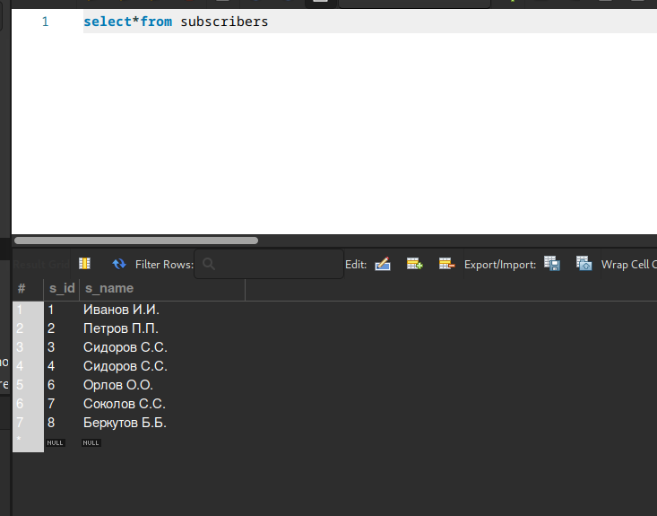
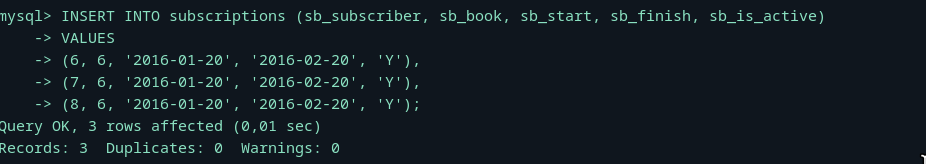

## Для всех выдач, произведённых до 1-го января 2012-го года, уменьшить значение дня выдачи на 3.
```bash
UPDATE subscriptions
SET sb_start = DATE_SUB(sb_start, INTERVAL 3 DAY)
WHERE sb_start < '2012-01-01';
```


## Отметить как невозвращённые все выдачи, полученные читателем с идентификатором 2.
```bash
UPDATE subscriptions
SET sb_is_active = 'N'
WHERE sb_subscriber = 2;
```


## Не знаю, говорили кто то об этом или нет, но психология уже есть (Добавить в базу данных жанры «Политика», «Психология», «История».)




## Добавить в базу данных информацию о троих новых читателях: «Орлов О.О.», «Соколов С.С.», «Беркутов Б.Б.».



## Отразить в базе данных информацию о том, что каждый из троих добавленных читателей 20-го января 2016-го года на месяц взял в библиотеке книгу «Курс теоретической физики».
```bash
INSERT INTO subscriptions (sb_subscriber, sb_book, sb_start, sb_finish, sb_is_active)
VALUES
(6, 6, '2016-01-20', '2016-02-20', 'Y'),
(7, 6, '2016-01-20', '2016-02-20', 'Y'),
(8, 6, '2016-01-20', '2016-02-20', 'Y');
```

