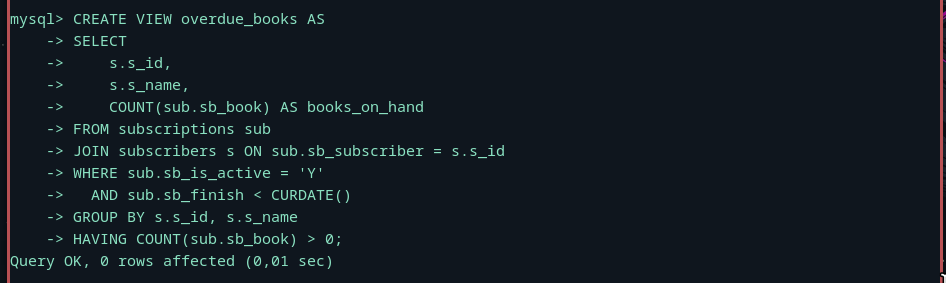
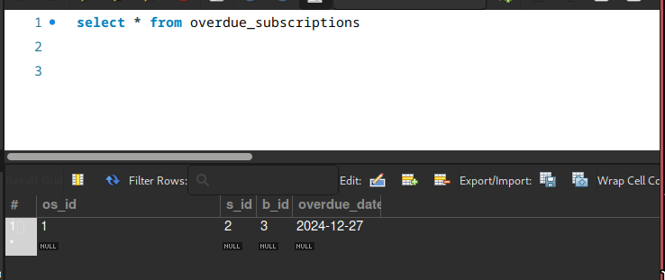
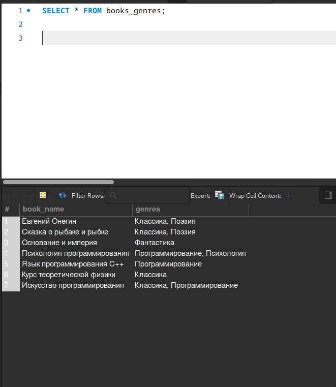
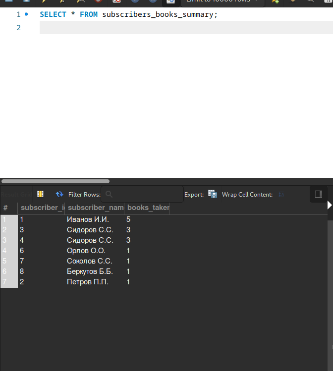
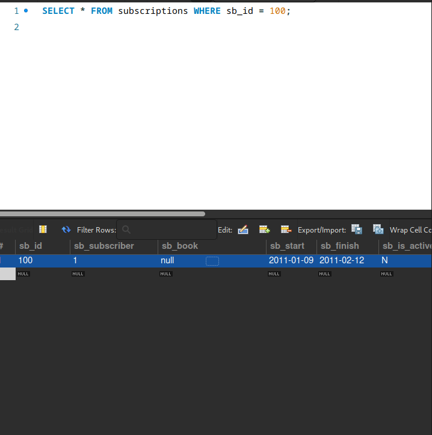
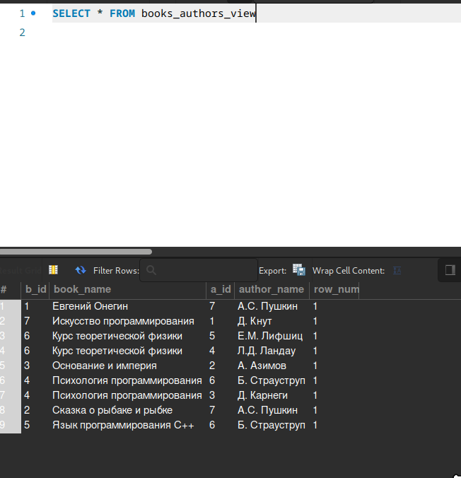

## Создать представление, позволяющее получать список читателей с количеством находящихся у каждого читателя на руках книг, но отображающее только таких читателей, по которым имеются задолженности, т.е. на руках у читателя есть хотя бы одна книга, которую он должен был вернуть до наступления текущей даты.

### Создание представления


### Триггер на обновление статуса
```bash 
DELIMITER //

CREATE TRIGGER insert_subscription_status
AFTER INSERT ON subscriptions
FOR EACH ROW
BEGIN
    IF NEW.sb_is_active = 'Y' AND NEW.sb_finish < CURDATE() THEN
        INSERT INTO overdue_subscriptions (s_id, b_id, overdue_date)
        VALUES (NEW.sb_subscriber, NEW.sb_book, CURDATE());
    END IF;
END//

DELIMITER ;

```
### Проверка срабатывания(срабатывает только при добавлении записи)



## Создать кэширующее представление, позволяющее получать список всех книг и их жанров (две колонки: первая – название книги, вторая – жанры книги, перечисленные через запятую).
```bash
CREATE VIEW books_genres AS
SELECT
    b.b_name AS book_name, 
    GROUP_CONCAT(g.g_name ORDER BY g.g_name SEPARATOR ', ') AS genres
FROM
    books b
JOIN
    m2m_books_genres bg ON b.b_id = bg.b_id
JOIN
    genres g ON bg.g_id = g.g_id
GROUP BY
    b.b_id;

```


## Создать представление, через которое невозможно получить информацию о том, какая конкретно книга была выдана читателю в любой из выдач.

### Создание представления без информации о книгах
```bash 
CREATE VIEW subscribers_books_summary AS
SELECT
    s.s_id AS subscriber_id,
    s.s_name AS subscriber_name,
    COUNT(sub.sb_book) AS books_taken
FROM
    subscriptions sub
JOIN
    subscribers s ON sub.sb_subscriber = s.s_id
GROUP BY
    s.s_id;
```
### Триггер для скрытия информации о книгах при изменении записи
```bash
DELIMITER //

CREATE TRIGGER mask_book_info_before_update
BEFORE UPDATE ON subscriptions
FOR EACH ROW
BEGIN
    SET NEW.sb_book = NULL;
END//

DELIMITER ;

```
### проверка представления


### А теперь триггер 

(При правильной работе sb_book равняется нулл, ибо при ИЗМЕНЕНИИ записи подставляется значение )

### Создать представление, извлекающее из таблицы m2m_books_authors человекочитаемую (с названиями книг и именами авторов вместо идентификаторов) информацию, и при этом позволяющее модифицировать данные в таблице m2m_books_authors (в случае неуникальности названий книг и имён авторов в обоих случаях использовать запись с минимальным значением первичного ключа).

```bash
CREATE VIEW books_authors_view AS
SELECT 
    m.b_id,
    b.b_name AS book_name,
    m.a_id,
    a.a_name AS author_name,
    ROW_NUMBER() OVER (PARTITION BY b.b_name, a.a_name ORDER BY m.b_id) AS row_num
FROM
    m2m_books_authors m
JOIN
    books b ON m.b_id = b.b_id
JOIN
    authors a ON m.a_id = a.a_id;
```




