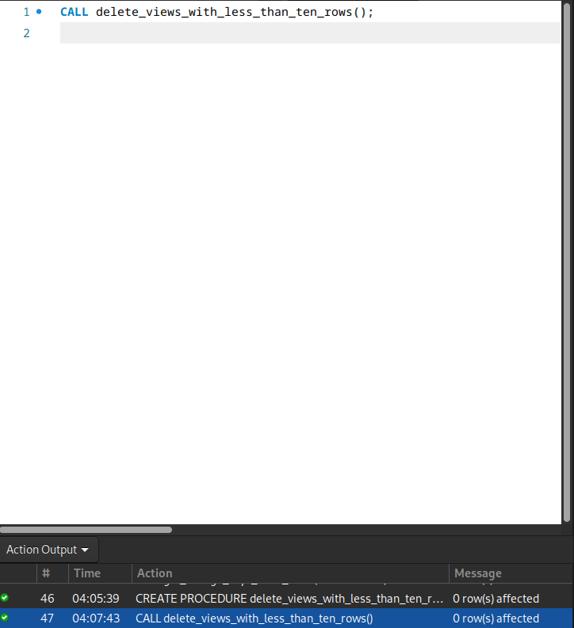

# ФИНАЛЬНАЯ БИТВА!!!!

## Создать хранимую функцию, получающую на вход идентификатор читателя и возвращающую список идентификаторов книг, которые он уже прочитал и вернул в библиотеку.
```sql
DELIMITER //

CREATE FUNCTION get_returned_books(s_id INT)
RETURNS TEXT
DETERMINISTIC
BEGIN
    DECLARE books_list TEXT DEFAULT '';
    SELECT GROUP_CONCAT(sb_book) INTO books_list
    FROM subscriptions
    WHERE sb_subscriber = s_id AND sb_is_active = 'N';

    RETURN books_list;
END//

DELIMITER ;
```


## Создать хранимую процедуру, формирующую список таблиц и их внешних ключей, зависящих от указанной в параметре функции таблицы

```sql
DELIMITER //

CREATE PROCEDURE get_foreign_keys_from_table(IN table_name VARCHAR(255))
BEGIN
    CREATE TEMPORARY TABLE IF NOT EXISTS fk_info (
        table_name VARCHAR(255),
        constraint_name VARCHAR(255),
        column_name VARCHAR(255),
        referenced_table_name VARCHAR(255),
        referenced_column_name VARCHAR(255)
    );

    INSERT INTO fk_info (table_name, constraint_name, column_name, referenced_table_name, referenced_column_name)
    SELECT 
        kcu.TABLE_NAME, 
        kcu.CONSTRAINT_NAME, 
        kcu.COLUMN_NAME, 
        kcu.REFERENCED_TABLE_NAME, 
        kcu.REFERENCED_COLUMN_NAME
    FROM information_schema.KEY_COLUMN_USAGE kcu
    JOIN information_schema.TABLE_CONSTRAINTS tc 
        ON kcu.CONSTRAINT_NAME = tc.CONSTRAINT_NAME
    WHERE kcu.REFERENCED_TABLE_NAME = table_name
      AND tc.CONSTRAINT_TYPE = 'FOREIGN KEY';


    SELECT * FROM fk_info;

    DROP TEMPORARY TABLE fk_info;
END//

DELIMITER ;

```


## Создать хранимую процедуру, удаляющую все представления, для которых SELECT COUNT(1) FROM представление возвращает значение меньше десяти.
```sql
DELIMITER //

CREATE PROCEDURE delete_views_with_less_than_ten_rows()
BEGIN
    DECLARE done INT DEFAULT 0;
    DECLARE view_name VARCHAR(255);
    DECLARE cur CURSOR FOR 
        SELECT table_name
        FROM information_schema.views
        WHERE table_schema = DATABASE(); 

    DECLARE CONTINUE HANDLER FOR NOT FOUND SET done = 1;

    OPEN cur;

    read_loop: LOOP
        FETCH cur INTO view_name;
        IF done THEN
            LEAVE read_loop;
        END IF;

        SET @sql = CONCAT('SELECT COUNT(1) INTO @row_count FROM ', view_name);
        PREPARE stmt FROM @sql;
        EXECUTE stmt;
        DEALLOCATE PREPARE stmt;

        IF @row_count < 10 THEN
            SET @drop_sql = CONCAT('DROP VIEW ', view_name);
            PREPARE drop_stmt FROM @drop_sql;
            EXECUTE drop_stmt;
            DEALLOCATE PREPARE drop_stmt;
        END IF;
    END LOOP;

    CLOSE cur;
END//

DELIMITER ;
```
