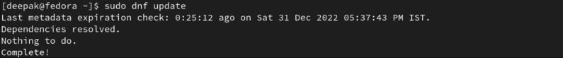
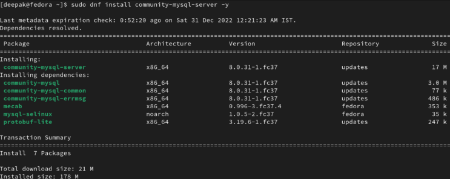
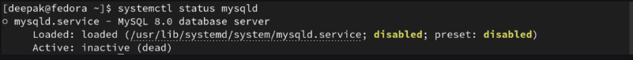
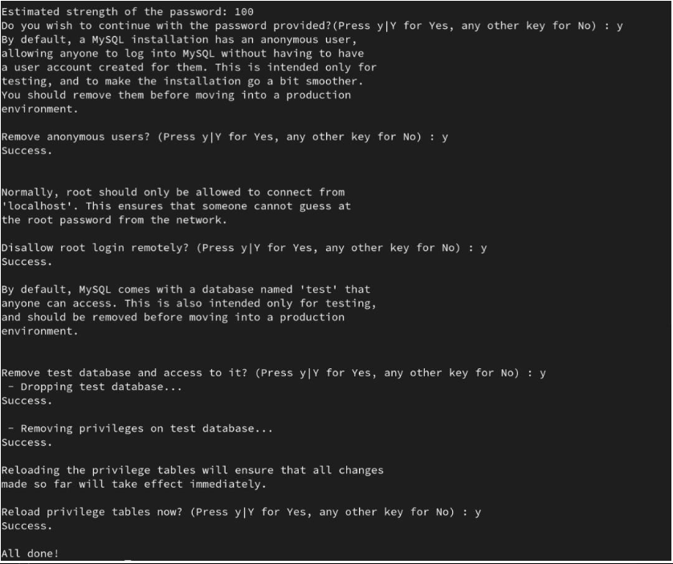
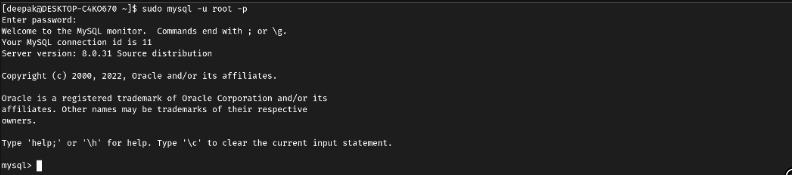
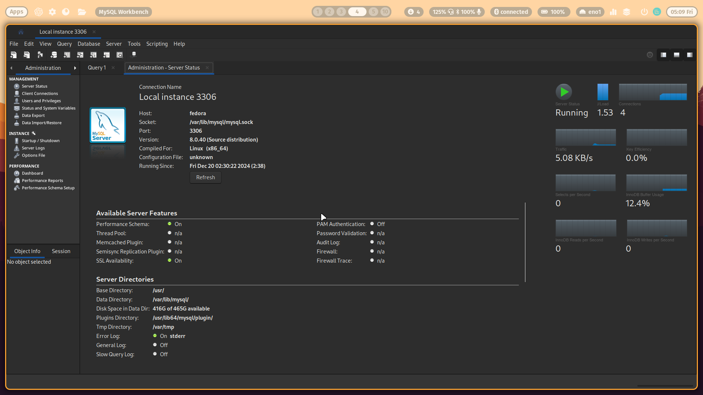
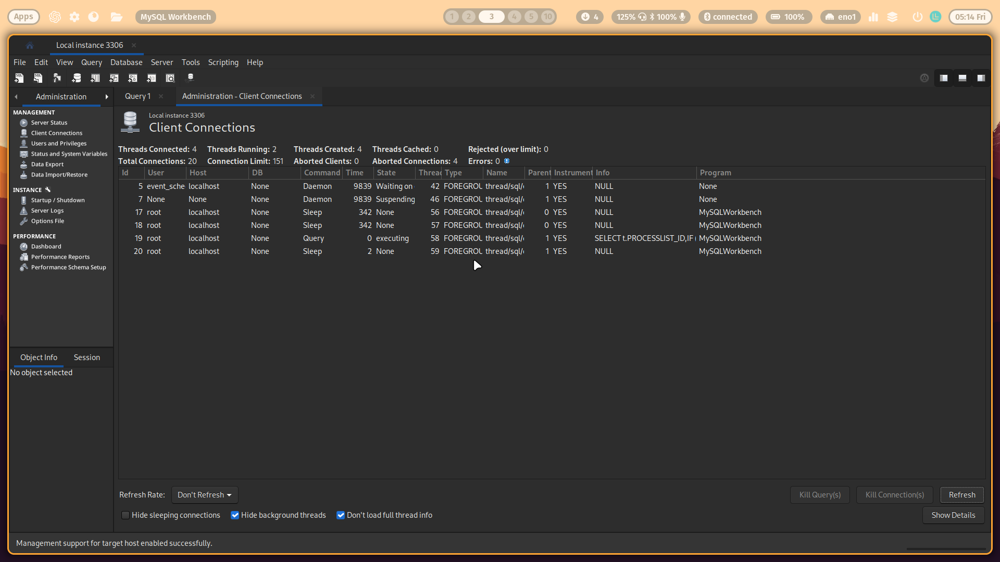
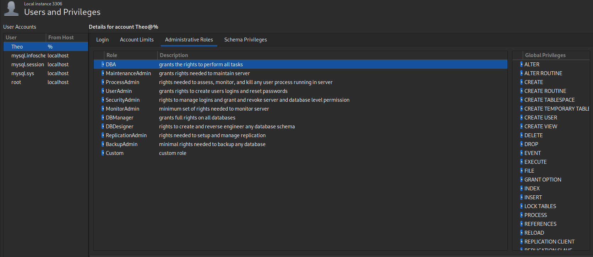
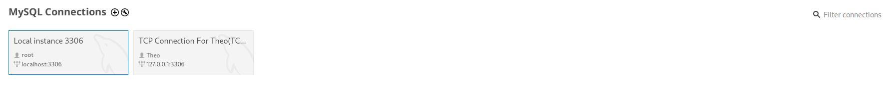

### ЗНАКОМСТВО С ИНСТРУМЕНТАМИ MYSQL SERVER (COMMUNITY EDITION)( В Трех Актах)

## АКТ 1. Установка на Fedora Linux.

MySQL - это популярная система управления реляционными базами данных с открытым исходным кодом. 
Перед началом установки рекомендуется обновить систему до последней версии:

```bash
sudo dnf update
```



Существует два основных способа установки MySQL на Fedora:

1. Установка из официального репозитория Fedora
2. Установка из репозитория Oracle MySQL

Установка из репозитория Fedora является более простым методом и подходит для большинства пользователей. Она выполняется с помощью следующей команды:

```bash
sudo dnf install community-mysql-server -y 
```



После установки необходимо запустить и включить сервис MySQL
```bash
sudo systemctl start mysqld
sudo systemctl enable mysqld
```



Для повышения безопасности рекомендуется выполнить скрипт mysql_secure_installation, который поможет настроить базовые параметры безопасности.




Запуск MySQL в Fedora

После безопасной установки (ШАГ-3) мы создали пароль для пользователя root. Теперь мы войдем на сервер MySQL с привилегиями root, используя команду:

```bash
mysql -u root -p
```

После ввода этой команды вам будет предложено ввести пароль, который вы установили для пользователя root.



### НО ЭТО НЕ ВСЕ!!!

## Установка MySQL Workbench на Fedora

MySQL Workbench — это мощный инструмент для работы с базами данных MySQL, который предоставляет графический интерфейс для администрирования, проектирования и разработки баз данных. Установка MySQL Workbench на Fedora может быть выполнена с помощью пакетного менеджера `dnf`. Ниже приведены шаги для установки приложения.

### Шаги по установке

1. **Откройте терминал**: Вам потребуется доступ к командной строке.

2. **Обновите список пакетов**: Перед установкой рекомендуется обновить список доступных пакетов, чтобы убедиться, что вы устанавливаете последнюю версию.
   ```bash
   sudo dnf update
   ```

3. **Установите MySQL Workbench**: Используйте следующую команду для установки MySQL Workbench:
   ```bash
   sudo dnf install mysql-workbench
   ```

4. **Запустите MySQL Workbench**: После завершения установки вы можете запустить MySQL Workbench через меню приложений или выполнив следующую команду в терминале:
   ```bash
   mysql-workbench
   ```

### Дополнительные сведения

- Если MySQL Workbench не доступен в стандартных репозиториях Fedora, вы можете загрузить его с официального сайта MySQL и установить вручную. Для этого скачайте `.rpm` пакет и используйте следующую команду:
  ```bash
  sudo rpm -ivh mysql-workbench-community-version.x86_64.rpm
  ```
  Замените `version` на номер версии вашего загруженного файла.

- Убедитесь, что у вас установлены все необходимые зависимости, такие как `gnome-keyring-daemon`, если вы планируете использовать функции хранения паролей.

Как результат, у нас выходит такая картина:




Установка MySQL на Fedora предоставляет надежную и производительную систему управления базами данных, которая широко используется в веб-разработке и других приложениях.

## АКТ 2. Настройка профиля и connection.


Для подключения к серверу MySQL через терминал в Fedora вам нужно выполнить несколько простых шагов. 

### Шаги для подключения к MySQL

1. **Откройте терминал**: Запустите терминал на вашем компьютере.

2. **Подключитесь к MySQL**: Используйте следующую команду для подключения к серверу MySQL. Замените `root` на имя пользователя, если вы используете другого пользователя, и введите пароль, когда будет запрошено.
   ```bash
   mysql -u root -p
   ```
   Если сервер находится на удаленном хосте, добавьте параметр `-h`, указав IP-адрес или имя хоста:
   ```bash
   mysql -h <IP-адрес_или_имя_хоста> -u <имя_пользователя> -p
   ```

3. **Введите пароль**: После ввода команды вам будет предложено ввести пароль для указанного пользователя. Введите его и нажмите Enter.

4. **Проверьте соединение**: Если подключение прошло успешно, вы увидите приглашение MySQL, где сможете выполнять команды SQL. Например, для отображения списка баз данных выполните:
   ```sql
   SHOW DATABASES;
   ```

### Примечания

- Если вы впервые подключаетесь к MySQL, убедитесь, что сервер запущен. Вы можете проверить статус службы MySQL с помощью команды:
  ```bash
  systemctl status mysqld
  ```
  Если служба не запущена, используйте:
  ```bash
  sudo systemctl start mysqld
  ```

- Для создания нового пользователя или настройки прав доступа используйте команды SQL, такие как `CREATE USER` и `GRANT`. Например:
  ```sql
  CREATE USER 'newuser'@'localhost' IDENTIFIED BY 'password';
  GRANT ALL PRIVILEGES ON *.* TO 'newuser'@'localhost';
  ```

Итог: настроенные подключения хостов



Выдача суперправ



## АКТ 3. ЧИСТЕЙШИЙ БАЛДЕЖ

### Так, как взаимодействие с терминалом на акте 2 заканчивается, как и в целом с CLI MySQL, можно расслабиться (до боижайшего дропа сетов) 

Дело остается за малым. Организовать подключение для себя:



